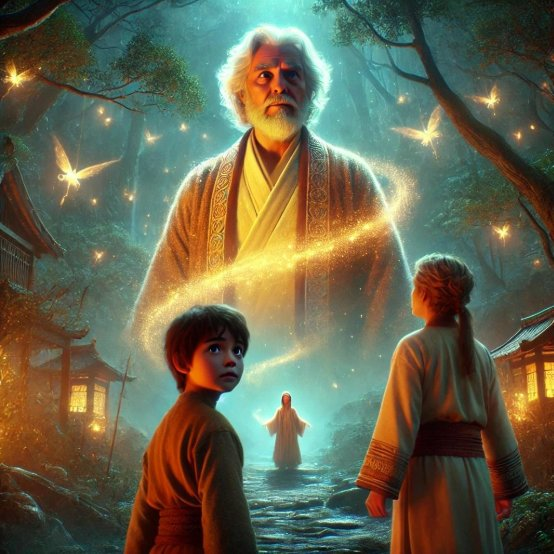
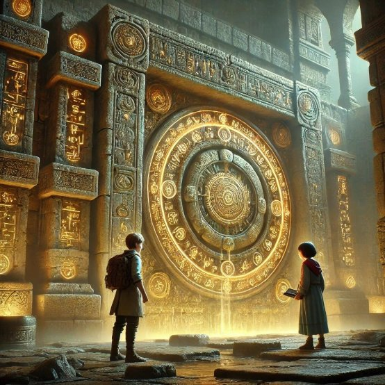
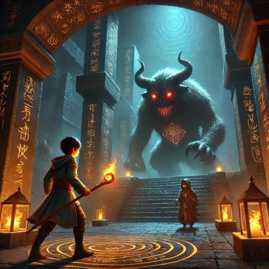
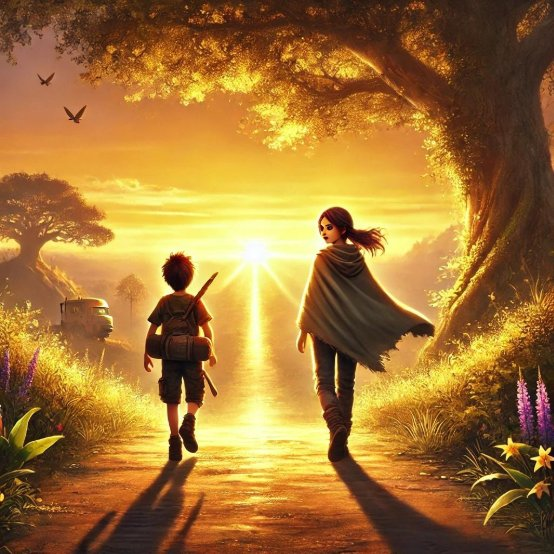

S24214362

The Key of Destiny

In a distant valley, there was a peaceful village. A young boy named Chenxi grew up hearing an ancient legend: deep within the dark forest lay a mysterious key that could change one’s fate. One day, Chenxi decided to leave his homeland and embark on a journey to find the key.

Along the way, he met a wise girl named Liyue. The two joined forces, supporting each other through the perils ahead. As they ventured into the forest, they faced Intricate mazes and fierce beasts, their hearts torn between fear and anticipation. Just as doubt began to cloud their minds.

A mysterious old man appeared, guiding them toward their path. As Chenxi and Liyue journeyed further, they encountered countless trials. They crossed treacherous swamps and raging rapids, overcoming obstacles together; they scaled steep cliffs, relying on each other’s strength to push forward. Through these hardships, they gradually understood that true courage came from unwavering belief.

At last, they arrived at a mysterious ancient city, where a massive stone gate lay 

hidden. Chenxi deciphered the ancient riddles within the ruins, activating the mechanism that revealed a secret chamber containing the key. Just as they rejoiced, darkness suddenly descended upon the city—an evil force ambushed them, seeking to seize the key. Chenxi and Liyue fought valiantly, engaging in a fierce battle. At the critical moment, they summoned all their courage and finally drove the darkness away.

With peace restored to the ancient city, Chenxi and Liyue returned the key to its rightful guardian, realizing that the true power to change fate lay not in the key itself, but in an unyielding heart. They each returned to their homelands, carrying the precious memories of their journey as they stepped toward a bright future. Through this adventure, they not only grew as individuals but also learned to cherish the present and trust one another.

The hardships they faced together were like a forge, revealing endless possibilities hidden within adversity. The road ahead remained long, filled with unknown wonders and challenges, but with their steadfast hearts, they would face the radiant dawn together. With unwavering trust, they would create a brilliant future—never stopping, always moving forward!

