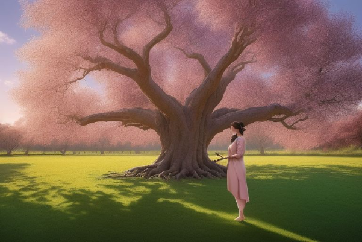
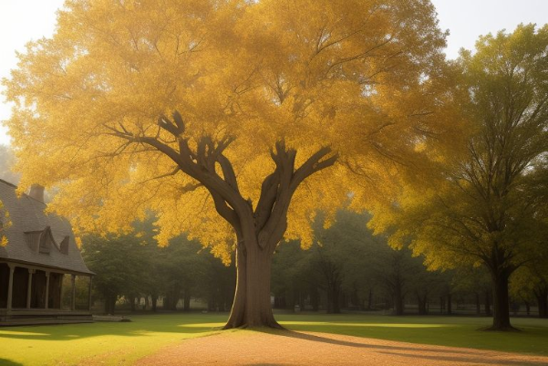
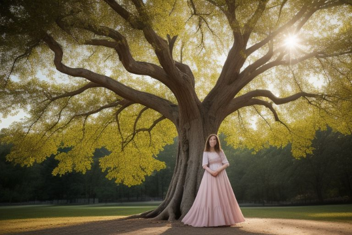
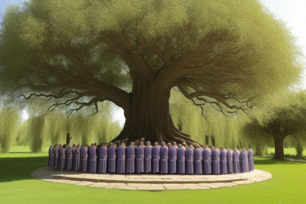
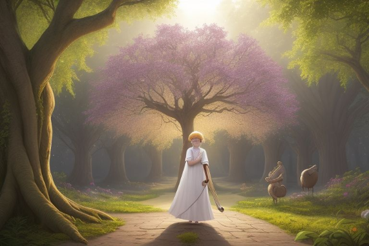
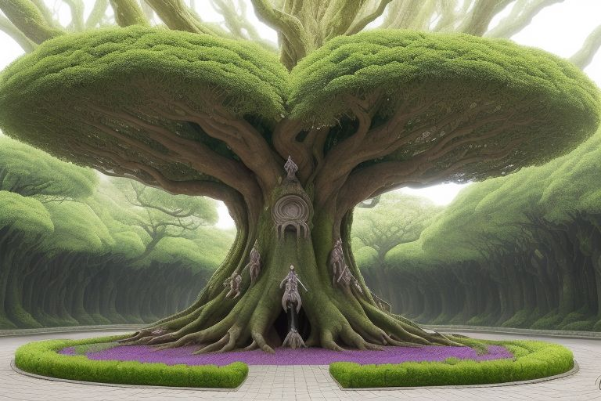
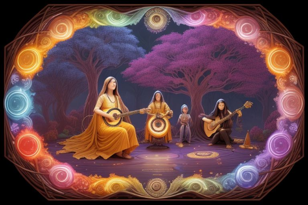
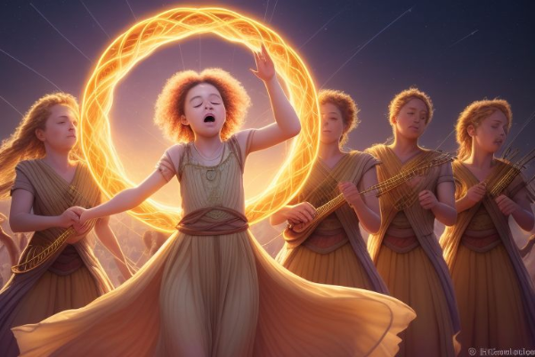
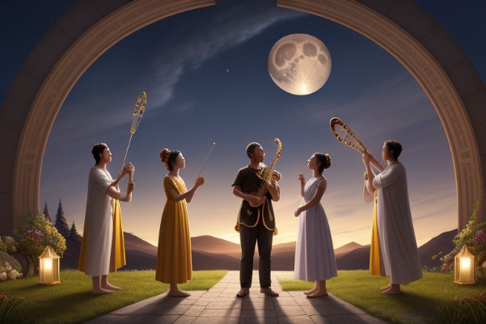

# **STORY:Guardian Lila**
# **In the quaint village of Echo Hollow, nestled at the foot of the Whispering Peaks, the villagers were known far and wide for their enchanting music and harmonious way of life. The heart of their community was the ancient Melody Tree, a colossal willow with branches that stretched across the sky and leaves that shimmered in every hue of the rainbow. The villagers believed that the tree's roots held the very essence of their world's melodies, and it was their duty to play, sing, and dance in tune with its whispers to maintain the balance of their realm. Among them was a young girl named Lila, whose voice was said to be the sweetest of all, resonating with the purest of the tree's notes.**
#
# 
#
# **Lila had been training her entire life to become the village's next Melody Guardian, a sacred role passed down through generations, whose responsibility was to commune with the Melody Tree and ensure that its music remained untainted. However, unbeknownst to the villagers, a shadow loomed over their idyllic existence. The once-harmonious symphony of the Melody Tree had begun to falter, and whispers of a mysterious force called the Discord grew louder with each passing moon. This malevolent energy threatened to invade the sanctity of Echo Hollow, seeking to corrupt the very essence of their music and plunge the world into a silent despair. Sensing the impending doom, the wise elder, Harmonious Heartwood, called upon a council of guardians from the neighboring lands to form an alliance and combat the growing threat. Together, they would embark on a quest to uncover the source of the Discord and restore the Melody Tree to its former glory.**

**As the day of the grand council approached, Lila felt a mix of excitement and trepidation. Her dream of protecting the Melody Tree was about to unfold, yet she knew the weight of the task ahead was immense. Harmonious Heartwood, noticing the anxiety etched on her face, took her aside and spoke in a gentle, reassuring tone, "Fear not, young Lila, for the tree has chosen you. Within your heart lies a song more potent than any weapon, and together with the allied guardians, you shall be the beacon that drives away the shadows." With a solemn nod, Lila vowed to uphold her duty and prepare herself for the journey that awaited her. Meanwhile, the Discord grew stronger, casting an eerie silence across the lands, hinting at its sinister intentions. The very fabric of Echo Hollow's reality seemed to quiver in anticipation of the approaching conflict. The villagers, though worried, put their faith in the council's wisdom and Lila's pure voice. They knew that together, they could not be silenced, for music was the lifeblood that connected them all.**

**The grand council convened in the heart of the village, an open-air amphitheater carved from the very roots of the Melody Tree itself. Here, the guardians from distant lands gathered, each representing a unique aspect of their world's music. There was the fiery Strummer of the Sanguine Strings from the lands of Crescendo Canyon, whose lute could summon fiery crescendos that illuminated the night sky. The ethereal Whisperer of the Zephyrite Flutes hailed from the floating islands of Aria Archipelago, her melodies capable of soothing even the harshest of storms. Then there was the stoic Beater of the Thunderous Drums from the dense forests of Cadence Jungle, whose rhythms could shake the ground and rally the spirits of those who heard them. And the elusive Singer of the Stellar Scales, a creature of the stars, whose siren-like voice could navigate the most treacherous of cosmic pathways. As they sat in a circle, instruments in hand, Harmonious Heartwood introduced Lila to the assembly, her eyes wide with wonder at the array of guardians she was about to join. Each guardian played a note on their instrument, and the air vibrated with a symphony of sound, acknowledging Lila's place among them. With a deep breath, she closed her eyes and opened her mouth, her voice soaring into the heavens, weaving a melody that resonated with the very soul of the Melody Tree. The tree's leaves fluttered in approval, and the guardians knew that she was indeed the chosen one. With their alliance sealed by the power of music, they set forth on their quest, each step in rhythm with the hope that together, they would conquer the Discord and bring harmony back to their world.**

**As the guardians dispersed to ready their instruments and gather their supplies, Lila retreated to the secluded grove where she had first discovered her gift for music. Beneath the shimmering leaves of the Melody Tree, she sat with her trusty lute, which had been carved from the very heart of the tree itself. The lute was said to contain the echoes of all the melodies that had ever been played in Echo Hollow, and it was here that Lila sought guidance and strength. She closed her eyes, allowing the gentle whispers of the tree to fill her soul. The tree's music grew louder, wrapping her in a warm embrace, and she felt the vibrations of each note resonate deep within her chest. A vision unfolded before her, a series of images that painted the story of the Silence Weaver and its twisted loom. The creature was a grotesque amalgamation of shadow and sound, with hands that wove threads of discord into the fabric of the world. Lila knew that she had to find a way to harmonize with the creature, to reach the core of its being and free it from the shackles of its own malice. With a newfound sense of resolve, she strummed the lute, and a soft, hopeful melody emerged. It was a song of unity and redemption, one that she would carry with her into the Silent Expanse, a beacon to guide her through the darkness and a weapon to counter the Weaver's destructive tunes. As the final note of her vision's melody faded, she opened her eyes to find a single, radiant leaf resting in her palm—a token of the Melody Tree's faith in her quest. Lila clutched the leaf tightly, feeling the warmth of the tree's magic pulse through her veins, and returned to the village to share her newfound knowledge with her fellow guardians. The time had come for the harmonious allies to set forth and confront the Discord that threatened to unravel the symphony of their world.**

**The next morning, as the first rays of dawn kissed the tips of the Melody Tree, Lila and the guardians gathered at the village's edge. They were an unlikely band of heroes, their instruments a stark contrast to the weapons of war, yet they were united by a shared bond of music that transcended their differences. The Strummer's fiery passion, the Whisperer's serene grace, and the Beater's unyielding resolve melded with Lila's pure, unwavering melody. With a collective deep breath, they began to play, their music weaving an intricate web of protection around them as they stepped into the Silent Expanse. The landscape was a barren symphony of desolate dunes and jagged rock formations, where the only sound was the haunting echo of their own footsteps. As they ventured deeper, the air grew thick with discordant whispers, and the very ground seemed to tremble in dissonance. Yet, Lila's song remained a constant beacon of hope, guiding them through the cacophony. Each guardian played their part, their instruments creating a harmony that pushed back the shadows, allowing them to progress. The journey was long and fraught with perilous challenges, but they pressed on, driven by the love for their lands and the music that defined them.**

**After weeks of traversing the Silent Expanse, Lila and the guardians stumbled upon a hidden oasis, a stark contrast to the desolate wasteland surrounding them. The air was thick with the sweet aroma of untouched blooms, and the sound of distant melodies played by the lost spirits of musicians long consumed by the Discord filled their ears. It was here, in the heart of the Expanse, that they discovered the lair of the Silence Weaver. The creature's loom loomed before them, a twisted monstrosity of black threads that stretched into the horizon, pulsing with malicious intent. The Weaver, a being of shadow and sound, sat hunched over its creation, its gnarled hands moving with a disturbing rhythm as it wove its destructive symphony. The guardians exchanged determined glances, knowing that the time had come to face the source of their world's anguish. With a nod from Harmonious Heartwood, they positioned themselves around the loom, each ready to strike a chord that would resonate through the very essence of the Weaver's domain. Lila stepped forward, her lute shimmering with the light of the Melody Tree, and began to play the harmonious tune that had been granted to her in her vision. Her melody grew in power, each note resonating with the guardians' instruments, creating a crescendo of sound that threatened to shatter the loom's very foundation. The Silence Weaver, feeling the intrusion, lifted its hooded head and revealed its twisted form, a symphony of anger and despair. It let out a shriek that could silence the loudest storm, yet Lila's song remained unbroken, her voice a testament to the resilience of music in the face of chaos. The guardians took this as their cue to attack, their instruments transforming into extensions of their wills as they struck at the Weaver's threads, each note cutting through the discord like a knife through shadow. The battle was fierce, their music clashing with the Weaver's, but the guardians' unity was unshakeable, their tunes intertwining into a tapestry of hope that slowly began to envelop the creature. With a final, piercing chord, the loom shuddered and collapsed, the threads snapping like brittle twigs under the weight of their combined melody. The Silence Weaver let out a wail that echoed through the wasteland, its form dissipating into the very fabric of discord it had spawned.**

**With the Silence Weaver defeated, the once-desolate Silent Expanse began to change before their very eyes. The black threads of discord slowly unwound, revealing the vibrant melodies they had once been, as the lost spirits of the consumed musicians were set free. The oasis grew, blooming into a lush garden of sound, and the air was filled with the sweet symphony of their collective relief. The guardians, though weary from their battle, played a victory tune, their music resonating across the lands, signaling the beginning of the Discord's retreat. The spirits, now liberated from the Weaver's grasp, joined in the celebration, adding their own notes to the grand finale. The Melody Tree's power surged through Lila's veins as she sang the final verse of her redemption song, a melody that reached into the darkest corners of the Expanse, healing the very earth and air itself. The realm of Echo Hollow and its neighboring lands were restored, the music flowing freely once more, and the villagers, who had anxiously awaited their return, could feel the harmony reborn in their hearts. As the guardians made their way back to their respective lands, Lila looked back at the transformed wasteland, now a thriving sanctuary for music and life. Her journey had not only saved her village but had also forged bonds between the guardians that would last a lifetime. With her heart full of joy and her purpose clear, she knew that as long as the Melody Tree stood tall, she would be there to safeguard its music, ensuring that the storyworld remained forever bound by the power of harmony.**

**The guardians' triumphant return to Echo Hollow was met with a cacophony of cheers and applause, as the villagers had felt the shift in the very air they breathed—the Discord had been vanquished, and the Melody Tree's whispers grew stronger with each passing moment. A grand festival was hastily organized in their honor, with music and laughter echoing through the streets as if the very walls of the village were alive with joy. The Melody Tree, once again the vibrant heart of the community, was adorned with garlands of flowers and ribbons that fluttered in the breeze, each color a testament to the diverse notes that had been restored. At the festival's crescendo, Lila and her newfound companions took to the central stage, their instruments glowing with the light of unity. Together, they played a symphony that celebrated not just their victory, but the enduring spirit of music that had carried them through the darkest of times. As the final note reverberated through the night, the villagers looked upon the Melody Tree, which shimmered in response to their collective love and gratitude. Harmonious Heartwood stepped forward, a proud smile gracing his weathered face. "The prophecy has been fulfilled," he announced, his voice carrying across the hushed crowd. "The one who can sing with the Melody Tree's own voice shall lead us into an era of unprecedented peace and harmony. Ladies and gentlemen, I present to you, Lila, the Harmony Guardian of Echo Hollow!" The villagers erupted in jubilation, their voices joining together in a spontaneous chorus that seemed to ascend into the stars themselves. Lila, humbled by the title and the weight of her new role, looked at her mentor and the guardians who had become her friends. With the radiant leaf of the Melody Tree still clutched in her hand, she knew that she would do everything in her power to honor the trust placed in her. For she was not just Lila, the girl with the sweetest voice; she was now the embodiment of the music that bound their world, the beacon that would keep the Discord at bay for generations to come.**

