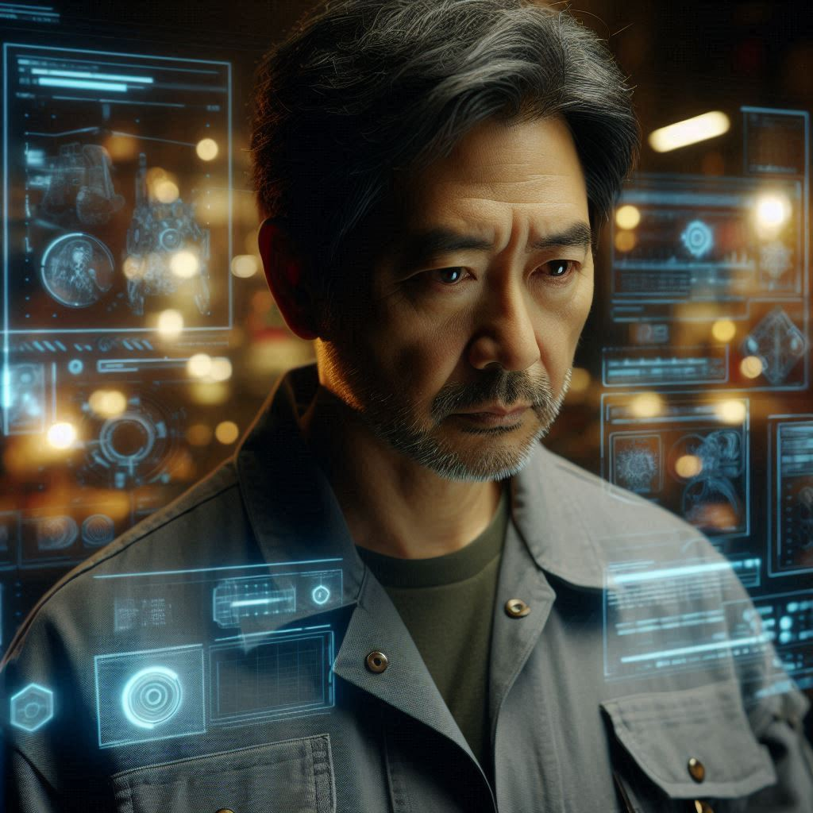

  
image prompt: 
    A sleek, futuristic corporate skyscraper at dusk, minimalist glass and steel architecture, with a large illuminated "新秩序科技" sign prominently displayed near the top of the building in glowing blue Chinese characters, dramatic lighting, cinematic composition, photorealistic, 8k, high detail

image prompt: 
    Cinematic futuristic cityscape, towering glass skyscrapers, dense network of glowing cables, surveillance drones hovering, satellites visible in sky, cyberpunk atmosphere, photorealistic, 8k resolution, dramatic lighting, high detail, wide angle shot

image prompt: 
    A complex digital artwork depicting a dystopian society. The top half shows a pristine, controlled city life with surveillance systems and digital identity markers floating above citizens. The bottom half reveals underground resistance networks and data streams. Visual metaphors include digital chains and surveillance eyes, contrasted with symbols of human resistance and hope. The artwork should have a cyberpunk aesthetic with dramatic lighting, photorealistic quality, and a (由於太長,超過了長度限制,被折斷了)

image prompt: 
    Professional Asian man in dark grey suit and blue tie, standing straight, emotionless expression, corporate office background, photorealistic portrait, 8k, high detail, cinematic lighting

image prompt: 
    Professional Asian man with furrowed brow and worried expression, looking downward, office cubicle background, dramatic shadows, photorealistic portrait, 8k, high detail

image prompt: 
    Asian man with intense determined gaze looking upward, slightly disheveled suit, dramatic lighting from below, cyberpunk atmosphere, photorealistic portrait, 8k, high detail

image prompt: 
    Portrait of a young Asian woman in business casual attire, black frame glasses, holding a tablet computer, mysterious and intelligent expression, dramatic lighting, photorealistic, 8k, high detail

image prompt: 
    Portrait of a middle-aged Asian man in grey engineer jacket, tired but determined expression, surrounded by holographic displays and electronic equipment glow, cyberpunk style, photorealistic, 8k, high detail

image prompt: 
    Portrait of a muscular Asian man in black security uniform with badge, alert stance, holding walkie-talkie, professional and vigilant expression, dramatic shadows, photorealistic, 8k, high detail

image prompt: 
    Abstract color palette design featuring dominant cool tones of steel blue, electric cyan and deep indigo, with small warm accents of amber and crimson, arranged in a modern geometric pattern, cyberpunk style, ultra HD, cinematic lighting, professional color theory visualization

image prompt: 
    Sterile white hospital corridor with cold LED lighting, minimalist medical equipment, empty nurses station, security cameras visible, clean clinical atmosphere, photorealistic, 8k, dramatic shadows

image prompt: 
    Hidden underground room with warm ambient lighting, exposed brick walls, vintage furniture, computer screens showing data, cozy but secretive atmosphere, photorealistic, 8k, cinematic lighting

image prompt: 
    Professional infographic diagram showing three-act story structure, minimalist design with geometric shapes, central figure in business attire surrounded by flowing timeline elements, act 1 shows office building and elevator, act 2 shows underground meeting and USB drive, act 3 shows hospital scene, connected by glowing data streams, dark background with neon blue accents, clean modern aesthetic, ultra HD render, cinematic lighting

image prompt: 
    Conceptual digital art triptych: Human figure standing at crossroads between high-tech city and natural landscape, binary code raining down one side while organic elements grow on other. Crowd of identical figures in corporate attire with one person breaking free from uniformity, shattering digital chains. Modern city street where half shows rigid controlled society and half shows free human expression, metaphorical visualization, dramatic lighting, cinematic composition, 8kk (i missclicked one more 'k')

image prompt: 
    Symbolic digital art: A human silhouette breaking free from a matrix grid, code fragments floating like butterflies. The figure stands against a cityscape where buildings morph between binary and concrete. Layers of reality peel away revealing truth. Dramatic lighting with warm sunlight breaking through cold tech patterns. Photorealistic, cinematic, 8K, depth focus on figure

image prompt: 
    A middle-aged Asian male doctor in a pristine white lab coat, inside a high-tech medical facility. He wears advanced medical devices and smart contact lenses. Clinical and detached expression, standing next to holographic medical displays. Clean, sterile environment with blue-tinted lighting. Cyberpunk medical aesthetic, realistic, 4K, detailed.

image prompt: 
    Elegant Chinese woman in her late 30s sipping coffee in an upscale cafe, wearing a beige business suit and pearl necklace, professional hairstyle, minimal makeup. Sitting gracefully on a leather sofa, holding a white porcelain coffee cup with perfect posture. Soft afternoon lighting, high-end interior, photorealistic style, 4K quality, professional photography, depth of field.

