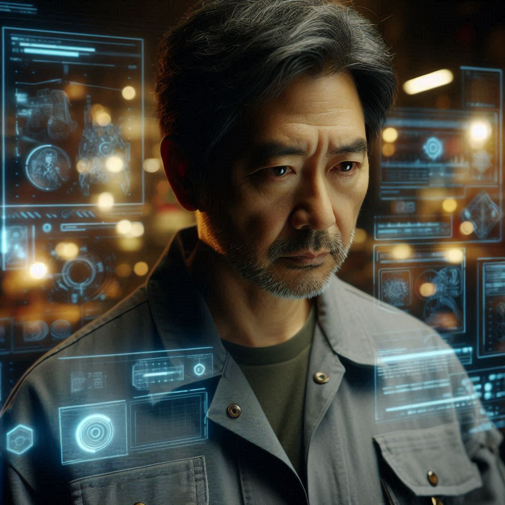

# 《意識裂縫:2048》

2048年，春末。

陳守正站在公司大樓的玻璃帷幕前，看著自己的倒影。一個標準的上班族形象：深灰色西裝筆挺，深藍色領帶一絲不苟，黑色公事包的肩帶精確地橫跨左肩。他習慣性地整理了一下袖口，確保每一個細節都完美對稱。

在新秩序科技這家跨國企業，他已經工作了五年。公司的辦公大樓聳立在商業區的中心，是這座城市效率化轉型的象徵之一。每天早上八點五十分，他會準時刷卡進入大樓。九點整，坐在自己的工位上開始處理文件。十二點三十分，和同事們一起到對面的員工餐廳用餐。下午五點四十五分，提交當天的工作報告。六點整，收拾東西準備離開。

這在新秩序科技是再普通不過的景象。

然而，最近幾週，一些微妙的違和感開始困擾著他。起初，他以為只是工作壓力造成的錯覺。但漸漸地，那種感覺越來越強烈，像是一根細小的刺，不斷地騷擾著他的神經。

他開始注意到一些以前從未在意的細節。比如，每天早上八點四十五分，大樓門口的保安換班時，交接的動作總是一模一樣，連手臂擺動的角度都分毫不差。午餐時間，同事們排隊打飯的隊伍會自動形成完美的蛇形，每個人之間的距離幾乎相等。甚至連茶水間的同事攪拌咖啡的次數，都保持著詭異的一致性。

「這不可能是巧合，」他在心裡默念，同時強迫自己把注意力轉回螢幕上的報表。但那些數字突然變得模糊起來，彷彿在暗示著什麼。他揉了揉太陽穴，試圖驅散這些不合邏輯的想法。

就在這時，辦公室的智能系統突然發出提示音：「系統例行更新即將開始，請各位同仁注意保存檔案。」

守正看了看時間：週三，上午十點整。這是公司固定的系統維護時間。往常他會像其他同事一樣，按部就班地保存文件，等待系統重啟。但今天，他注意到了一個以前從未在意的細節：更新提示音的頻率似乎和同事們敲擊鍵盤的節奏完全同步。

他站起身，假裝要去茶水間。路過其他工位時，他刻意放慢腳步，仔細觀察。每個人都在同一時間點擊「保存」按鈕，滑鼠點擊的聲音整齊得像是某種韻律。這種高度一致的行為模式讓他感到一陣寒意。

「請在五分鐘內完成當前工作，系統更新即將開始。」提示音再次響起。

守正走向電梯，打算趁這個機會到樓下透透氣。電梯門開啟時，他瞥見了控制面板上一個微小的異常：數字顯示幕的右下角有一個幾乎看不見的符號，像是某種特殊的標記。

就在他伸手按下按鈕的那一刻，大樓的供電系統突然發出一聲異響。電梯燈光閃爍了一下，然後驟然熄滅。在那短暫的黑暗中，他看到了一些不應該存在的東西：控制面板裡似乎有某種奇異的光芒在流動，像是電路板上的數據流。

然後，一切發生得太快。電梯猛地震動，守正失去平衡，後腦勺重重地撞在金屬扶手上。劇烈的疼痛中，他的視野開始扭曲。那一瞬間，他彷彿看到了電梯周圍的空間被某種無形的網格覆蓋，數據流在網格間流動，構成了一個龐大而複雜的控制矩陣。

「這絕對不正常，」這個念頭在他失去意識前閃過「這究竟是...什麼？」

守正失去平衡，重重地撞在後壁上，後腦勺撞上了金屬扶手。劇痛瞬間席捲全身，視線變得模糊。他感到一陣眩暈，耳中嗡嗡作響。在那短暫的幾秒鐘裡，他彷彿看到了一道電流從電梯控制面板竄出，在空中形成奇異的圖案，然後消失不見。這個幻覺如此真實，以至於他不確定自己是否真的看到了什麼。

「你還好嗎？」當電梯門終於被打開時，一位保安關切地問道。守正茫然地點點頭，感到後腦一陣抽痛。「只是輕微撞到了頭，」他說，試圖讓自己的聲音聽起來正常，「沒什麼大礙。」

但人事部的陳姐堅持讓他去做檢查。「公司規定，」她用那種不容拒絕的語氣說，「任何工作場所的意外都必須進行全面檢查。」守正注意到她的眼神有些異樣，似乎在評估著什麼。「小心為上，」她補充道，嘴角掛著一絲難以捉摸的微笑。

醫院的檢查結果顯示只是輕微腦震盪，沒有嚴重問題。但當守正躺在核磁共振儀器中時，他感到一種奇怪的刺痛感從後腦蔓延到全身。醫生說這只是正常反應，但守正總覺得有什麼地方不對勁。

「一切正常，」醫生最後宣布，「只需要休息幾天就好。」守正點點頭，但內心的不安卻越來越強烈。當他離開醫院時，他發現自己開始注意周圍人們的行為模式，尋找著那種難以名狀的異常感。

回到公司後，守正試圖將這次意外拋在腦後。然而，他發現自己的感知似乎變得更加敏銳。辦公室的噪音不再是模糊的背景聲，而是清晰可辨的個體：鍵盤敲擊聲、咖啡機運作聲、同事們交談的聲音...它們不再是隨機的，而是遵循著某種他無法言明的模式。

直到幾週後的那個午餐時間，這種感覺終於具體化了...

那天午餐時間,守正照常在十二點三十分走向公司對面的餐廳。他的思緒仍然被那次電梯事故所困擾，頭部偶爾還會傳來隱隱的疼痛。當他穿過馬路時，突然注意到周圍的同事們走路的方式有些奇怪。

起初，他以為是自己的錯覺。但當他刻意放慢腳步，仔細觀察時，那種異常感變得無法忽視。其他同事們的腳步節奏出奇地一致，不僅是步調，連擺臂的幅度都驚人地相似。彷彿他們都在遵循著某種無形的指揮，進行著一場精心編排的集體舞蹈。

守正感到一陣寒意順著脊椎爬上來。這不正常。人們走路應該有各自的節奏和習慣，不可能如此整齊劃一。他停下腳步，假裝整理衣服，繼續觀察。沒錯，每個人都以相同的頻率邁步，相同的角度擺臂，甚至連轉頭看路的時機都驚人地一致。

「這不可能是巧合，」守正在心中默念，感到一種難以名狀的恐懼漸漸滋生。他強迫自己冷靜下來，告訴自己這只是壓力和腦震盪後的幻覺。但內心深處，他知道自己看到的是真實的。

這個發現讓他愣了一下，但很快將這個想法拋在腦後，至少表面上是這樣。他不想讓自己看起來像個偏執狂。然而，一旦注意到這個細節，其他的異常也逐漸浮現在他的意識中，像是黑暗中亮起的警示燈，無法再被忽視。

轉機出現在一個平常的下午。守正走進茶水間時，一個身影引起了他的注意。新來的實習生小林正在沖泡咖啡，但她的動作與其他人截然不同。沒有那種機械式的精確，而是帶著一種自然的隨意。更引人注目的是，她並沒有像其他人那樣精確地攪拌七下，而是漫不經心地攪動著，目光若有所思地望向窗外。

守正走到咖啡機前，刻意放慢動作觀察。小林似乎察覺到了他的視線，但並沒有立即轉身。她的肩膀微微緊繃，像是在等待什麼。守正按照慣例取出咖啡杯，這時他注意到杯架上的擺放方式被人打亂了——所有杯子都整齊地朝向一個方向，唯獨小林剛剛用過的那個區域顯得雜亂。

就在他伸手去拿咖啡粉的時候，小林突然開口：「你的左手。」她的聲音很輕，幾乎像是自言自語。守正一愣，下意識地看向自己的左手——他正用不規則的節奏敲擊著咖啡機，這是他自己都沒有察覺的小動作。

他們的目光在咖啡機的反光中相遇，彼此都看到了對方眼中的警覺和了然。小林的嘴角露出一絲幾不可察的微笑，但眼神卻異常嚴肅。

「你也注意到了？」她壓低聲音問，目光卻看似隨意地掃視著茶水間的每個角落。守正注意到她的右手食指在杯緣上輕輕敲擊，形成一個奇怪的節奏——那不是摩斯密碼，而是某種他說不上來的熟悉模式。

守正謹慎地點頭，同時假裝在整理領帶。小林的動作看似自然地走到垃圾桶旁，將一張用過的濾紙扔掉。但守正注意到，她同時悄悄將一張對折的紙巾放在了咖啡機旁的糖包盒後面。

「如果你對這裡的咖啡感興趣，」她提高音量說，語氣變得公式化，「我可以推薦一些不錯的品牌。」她的眼神卻在傳達著完全不同的信息。

守正配合地點頭，等她離開後，他假裝去拿糖包，迅速取走了那張紙巾。上面只有一串數字和一句話：「這是我的私人號碼，不是公司分配的那支。今晚八點，等我電話。小心監控。」

他將紙巾捏在手心，感受著上面的字跡。這是他第一次遇到另一個「清醒」的人，這個發現既令人興奮又令人恐懼。當他走出茶水間時，注意到走廊的監控攝像頭正對著這個方向，紅色的指示燈有規律地閃爍著。

他們第一次聚會選在了城市邊緣的一家小咖啡館，店主是小林的遠房親戚，監控系統在這裡形同虛設。咖啡館的地下室經過特殊改造，成為了他們的秘密會議基地。厚重的混凝土牆壁能夠有效阻隔各種監控信號，而老舊的水管和電線則被巧妙地改造成了反監控設備。

守正到達時，其他人已經在等著了。

陳姐優雅地啜飲著咖啡，

老王正在擺弄一個看起來像是自製的電子設備，

阿明則警惕地注視著窗外。

小林向他們介紹了守正，然後他們開始分享各自的故事。

「在我解釋一切之前，」小林環顧四周，確保沒有人能聽到他們的談話，「我想先聽聽你們各自是如何注意到異常的。」

老王先開口了。「我不知道為什麼，但自從那次觸電事故後，我開始注意到一些奇怪的事情。同事們的行為太...一致了。而且我發現了網路上的異常數據包，每天定時發送，但沒有明顯的業務用途。」

阿明點點頭：「我也是。那次自動門事故後，我開始看到保安隊的同事們像是被編程一樣巡邏，連報告都一字不差。我以為是我太敏感了，直到看到那段監控錄像...」

守正感到一陣輕鬆，至少他不是唯一一個注意到這些異常的人。「我也是在電梯事故後開始注意到的。大家的動作太過協調，像是某種集體舞蹈。」

小林深吸一口氣，放下咖啡杯。「我要告訴你們的事情可能很難相信，但請聽我說完。」她的表情變得嚴肅，「這個城市，不，應該說是整個社會，都被一個隱秘的系統所控制。每個人的腦中都植入了一個微型控制器，用來調節思維和行為。」

房間陷入一片寂靜。守正感到一陣眩暈，這個解釋太過瘋狂，但又完美地解釋了所有異常現象。

「你怎麼知道這些的？」老王皺眉問道，工程師的本能讓他保持懷疑。

小林的特殊之處在於她的雙重身份。"我其實是個特例，"她壓低聲音解釋道，"我父親是控制系統的高級工程師，他在我十歲時就發現了這個系統的存在。"她的眼神變得複雜，"他試圖反抗，但失敗了。在被'處理'前，他秘密地改造了我的控制器，加入了一個干擾模組，讓我能夠保持部分意識的清醒。"

她輕輕撥弄著自己的髮絲，露出頸後一個幾乎看不見的細小疤痕。"這裡，他冒著巨大風險為我做了手術。為了掩護我，他偽造了數據，讓系統認為我是個'特殊研究對象'，需要保持部分思維活性以觀察控制效果。"她苦笑著說，"諷刺的是，正是這個謊言讓我能夠在學校和公司之間自由活動，系統認為我的'異常行為'是預期中的數據。"

「那我們呢？」阿明問道，下意識地摸了摸自己的後腦勺，「為什麼我們會...清醒？」

小林看向他們每個人：「你們都經歷了罕見的意外，而這些意外恰好損壞了你們腦中的控制器。這種情況極其罕見，系統設計者認為概率低到可以忽略不計，所以沒有特別的防範措施。」

「所以我們腦子裡真的有...某種裝置？」守正難以置信地問。

小林點點頭：「是的。而且根據我的研究，你們的控制器只是部分損壞，仍然可能被修復或重置。這就是為什麼我們必須小心行事，不能引起系統的注意。」

老王分享了他的經歷，聲音低沉而謹慎。「那次事故發生在季度系統維護期間，」他開始說，手指無意識地撫摸著左臂上一道細長的疤痕。「公司要求我們升級主伺服器的安全協議，這本該是個例行工作。但那天，一切都不太對勁。」

他的眼神變得深邃，像是在回憶什麼可怕的事情。「首先，維護時間被提前了，沒有按照標準流程發出通知。其次，所有的同事都被調去處理一個突發的網路故障，只留下我一個人。當時我沒有多想，但現在回想起來，那個故障來得太巧了。」

老王描述了當時的情景：「伺服器房的溫度異常高，遠超過正常運作溫度。監控面板上的數據在不停波動，像是有什麼東西在干擾讀數。最奇怪的是，我發現主控制台的日誌記錄出現了大量的異常條目，都是些無法解讀的加密數據。」

「就在我試圖追蹤這些異常數據的來源時，」他停頓了一下，確保每個人都在認真聽，「整個機房的設備突然開始不受控制。螢幕上的數字瘋狂跳動，伺服器機櫃發出不正常的嗡鳴。然後...」他深吸一口氣，「我看到了一些不該看到的東西。」

老王從口袋裡小心翼翼地取出一個經過改裝的舊手機。「這是我那天無意中記錄下來的數據，」他調出一段波形圖，「這些不是普通的系統信號，而是某種控制指令。它們的頻率和人腦的神經電波驚人地相似。」

阿明接過話題，他的故事同樣令人不安。「作為保安主管，我的工作就是觀察，」他說，眼神銳利如鷹，「但我從未想過，最大的異常會發生在監控系統本身。」

他描述了那個改變一切的夜晚：「B3層的高安全區域，那裡的門禁系統使用了最先進的生物識別技術。但那天晚上，系統顯示有人在深夜反覆嘗試訪問，卻在監控錄像中找不到任何人影。」

阿明壓低聲音：「更詭異的是，當我調查這個異常時，發現所有相關的日誌記錄都被自動刪除了。不是普通的刪除，而是被某種程式覆蓋，連備份系統都無法恢復。」

「就在我準備向上級報告時，」他的表情變得凝重，「那扇門突然失控了。它不僅違反了所有安全協議，還產生了一個強大的電磁脈衝。那種強度...」他搖搖頭，「不可能是意外。」

老王和阿明的合作揭示了更多真相。「我們發現每個樓層都有一個隱藏的數據節點，」老王指著一張手繪的示意圖，「這些節點會在特定時間向某個未知的伺服器傳輸大量數據。但最讓人不安的是，」他環顧四周，「這些數據的格式與人類的腦電波模式驚人地相似。」

阿明補充道：「而且，每次系統維護後，都會有一小部分員工的行為模式發生細微的改變。如果不是刻意觀察，很難發現這種變化。但從保安系統的角度來看，這些改變形成了一個清晰的模式。」

「我們正在建立一個地下網絡，」老王壓低聲音說，「使用改裝過的舊設備，通過特殊的加密協議通訊。系統太專注於監控新設備了，反而忽視了這些『廢品』。」

阿明點點頭：「每個『清醒者』都是一個節點，我們互相監視，互相保護。如果有人突然『消失』，其他人就能立即知道。」

守正的任務是收集各部門的工作日誌，尋找可能的異常模式。某天下午，他正在資料室查閱過去三個月的部門報告，試圖找出那些被送去「休假」的員工共同點。他的心跳加速，因為他發現了一個驚人的規律：這些人都有一個特徵：他們在被送走前，都曾經質疑過某些公司政策，或者表現出與常規不符的行為模式。

正當他專注於整理這些資料時，門突然開了。「在加班啊？」一個清潔工推著拖把車走了進來，面帶微笑地問道。

守正的心跳瞬間加速，但他強迫自己保持鎮定。「是啊，季度報告快到期了。」他若無其事地合上文件夾，假裝在整理桌面。

清潔工點點頭，開始在房間裡打掃。守正注意到他的動作有些不協調，不像其他員工那樣精確。更奇怪的是，他似乎對守正正在查閱的文件架特別感興趣，但又刻意避免直視那個方向。

守正假裝收拾東西，實際上迅速將關鍵文件藏進了公文包。「我差不多完成了，不打擾你工作了。」他說著，起身準備離開。

清潔工只是點點頭，繼續他不規則的打掃動作。當守正走到門口時，他忽然開口：「小心點，有些事情看起來並不像表面那樣。」

守正愣了一下，但當他轉身想問清楚時，清潔工已經背對著他，專注於擦拭窗戶，彷彿剛才的對話從未發生過。

守正帶著疑惑離開了資料室，但他確信自己沒有被發現。第二天，他檢查了資料室的監控記錄，發現那段時間的影像異常清晰，沒有任何可疑之處——這反而更加可疑了。

老王也遇到了挑戰。他的自製設備開始捕捉到一些奇怪的信號干擾。「有人在掃描網絡，」他在一次秘密會議上說，眼中閃爍著警覺的光芒，「但我已經採取了預防措施。我的系統現在會定期更換加密協議，並且偽裝成普通的網絡噪音。」他展示了一個微型設備，「這個小東西可以製造電磁干擾，剛好能掩蓋我們的通訊信號。」

阿明的偵查工作也變得越來越危險。「我發現有人在監視大樓的出入口，」他低聲說，眼神中帶著一絲緊張，「但我已經找到了幾條安全的路線。」他拿出一張手繪地圖，「這些是監控的盲點，我已經確認過，可以安全通過。」他還發現，通過調整巡邏路線，他可以創造出短暫的「安全窗口」，讓團隊成員在不被發現的情況下進行活動。

小林則利用她的學生身份作為掩護。「學校的網絡相對開放，」她解釋道，眼中閃爍著聰明的光芒，「我可以通過學術研究的名義收集數據，而不會引起懷疑。」她還開發了一種特殊的編碼方式，將敏感信息隱藏在看似普通的學術論文中。

守正逐漸展現出他的特殊才能。他有著驚人的觀察力和整合能力，能夠從看似無關的細節中發現模式。「看這個，」他指著一張自己繪製的關係圖，「每次系統更新後，都會有一批人被送去『休假』，而這些人都曾經在特定時間訪問過特定區域。」他的發現為團隊提供了寶貴的線索，幫助他們預測系統的行動模式。

經過數月的準備，他們終於掌握了關鍵證據：一個控制中樞的位置。就在他們準備展開行動的前夜，守正獨自一人站在公寓的窗前，望著城市的燈光。明天，他們就要潛入那個廢棄工廠，收集決定性的證據，然後將真相公諸於世，喚醒更多的人。

他感到一種奇怪的平靜，混合著恐懼和決心。他知道這次行動充滿風險，但他已經無法回頭了。自從那次電梯事故以來，他的生活已經徹底改變。他不再是那個循規蹈矩的普通職員，而是一個尋求真相的戰士。

守正拿出筆記本，翻到最後一頁，寫下了一段話：「如果你正在讀這個，那麼我可能已經失敗了。但請記住，系統並非無懈可擊。尋找那些行為不協調的人，他們可能是你的盟友。真相就在表面之下，只要你願意看見。」他將筆記本藏在了一個只有小林知道的地方。

計劃很簡單：利用系統同步時的防禦弱點，阿明會創造一個監控盲區；老王負責干擾信號；小林會從外部監控整個行動；守正和陳姐則負責潛入核心區域，獲取證據。他們約定在午夜十二點行動，那時工廠的人員最少。

當晚，守正最後一次檢查了裝備：一個改裝過的手機，可以記錄特殊頻率的信號；一個微型攝像機，隱藏在他的眼鏡框中；以及老王特製的信號干擾器，可以短暫阻斷控制器的信號。一切就緒，他深吸一口氣，走出了公寓。

夜色如墨，城市的燈光在雨中變得模糊而遙遠。守正按照計劃，在十一點四十五分到達了指定地點。阿明已經在那裡等著，臉上的表情異常嚴肅。「準備好了嗎？」他低聲問道。守正點點頭，感到喉嚨發緊。

他們按照計劃分頭行動。守正和陳姐悄悄接近了工廠的後門，等待著老王的信號。十二點整，他們的通訊器傳來了三聲短促的嗶嗶聲——這是行動開始的信號。

守正感到一陣眩暈，但他強迫自己集中注意力。他們成功進入了工廠，按照小林提供的地圖，向中心區域移動。一切都按照計劃進行，也許太順利了...

就在他們即將到達核心區域時，陳姐突然停下腳步。「等等，」她低聲說，「有些不對勁。」守正也感到一絲不安，但他們已經走得太遠，不能就此放棄。

「我們必須繼續，」他堅定地說，「這可能是我們唯一的機會。」

陳姐猶豫了一下，然後點點頭。他們繼續前進，終於到達了一扇金屬門前。門上沒有標記，但根據小林的資料，這應該就是控制中心的入口。

守正深吸一口氣，伸手推開了門。門後是一個巨大的空間，充滿了閃爍的螢幕和嗡嗡作響的機器。但最讓他震驚的是，房間中央站著一個人，背對著他們。

那人緩緩轉身，守正的心跳幾乎停止——那是他的部門主管。

「我們一直在等你，陳守正，」主管微笑著說，聲音出奇地平靜，「你比我們預期的要聰明得多。」

守正感到一陣眩暈，房間開始旋轉。他聽到陳姐在身後發出一聲輕笑，然後是一陣刺痛從後頸傳來。他的視線變得模糊，最後的意識是主管那張微笑的臉，和一句輕聲的話：「別擔心，很快你就會忘記這一切。」

意識逐漸消散，世界陷入一片黑暗。

當守正再次睜開眼睛時，發現自己躺在醫院的病床上，頭痛欲裂。一位醫生正在查看他的病歷。

「你醒了，」醫生微笑著說，「保安在公司附近的停車場發現你昏倒在地，看起來像是工作太累了。」

守正試圖回憶昨晚發生的事，但記憶一片模糊。「我的同事...」他虛弱地問道。

「別擔心，」醫生溫和地說，「好好休息，按時吃藥，很快就能回去工作了。」他熟練地在病歷本上書寫著，筆下的每一個字都整齊得彷彿是用印表機打印出來的一般。

守正看著床頭櫃上的病歷表，上面註明的入院時間是下午三點整。窗外，一群人步調一致地走過，恰好是傍晚六點。他的筆記本不知所蹤，手機裡也找不到小林他們的聯繫方式。

一種深深的絕望感襲來。難道一切都只是他的幻覺？那些會議，那些發現，那些計劃...都只是他受傷後的妄想？

他望向窗外的天空，忽然注意到一個清潔工正在擦拭對面大樓的玻璃。那人的動作出奇地不規則，與樓下人群的整齊劃一形成鮮明對比。守正盯著那個身影，突然意識到那是他在資料室遇到的同一個人。他們的目光在玻璃的倒影中相遇，清潔工朝守正眨了眨眼，手上的動作依然保持著令人費解的不規律。

守正的心跳加速。那個清潔工不僅眼熟，而且他的動作——那種刻意的不規則——正是他們小組用來識別彼此的暗號。這不可能是巧合。

更讓他震驚的是，當他無意中摸到枕頭下方時，他的手指觸碰到一個小物件。那是一個微型USB隨身碟，正是老王製作的那種。他小心翼翼地將它藏在手心，心跳如雷。

或許，這一切都不是他的幻覺。但如果是真的，那麼其他人在哪裡？計劃出了什麼問題？更重要的是，他現在該怎麼辦？

守正閉上眼睛，假裝休息，實際上卻在腦中快速整理著線索。那個USB隨身碟的重量在他手心變得灼熱，他知道裡面可能藏著關鍵的信息。但現在還不是查看的時候，監控攝像頭正對著他的病床，紅點持續閃爍著詭異的節奏。

他注意到，每隔十五分鐘，護士站的值班人員就會整齊劃一地站起來，走到走廊盡頭的飲水機前。這個動作太過完美，就像是某種設定好的程式。而那個神秘的清潔工，他的不規則動作反而顯得格格不入，卻又莫名地令人安心。

病房的電視正在播放新聞，報導著城市最新的「社會和諧指數」創下歷史新高。守正注意到，主播的語氣和表情與三個月前的報導一模一樣，連停頓的節奏都分毫不差。這不可能是巧合。

就在這時，他的病房門被推開。是那位戴金絲眼鏡的醫生，手裡端著病歷本。「感覺好點了嗎？」醫生微笑著問，但笑容未達眼底。守正注意到醫生的左手無意識地敲擊著病歷本，節奏與他之前在茶水間遇到小林時如出一轍。

「好多了，」守正回答，確保自己的語氣聽起來足夠疲倦。「我什麼時候可以出院？」

「再觀察一晚，」醫生說，「明天早上我們還需要做最後一次...檢查。」他特意加重了「檢查」這個詞，守正感到一陣寒意。

當醫生離開後，守正小心翼翼地將USB隨身碟藏進枕頭裡的一個小縫隙。他知道，明天的「檢查」很可能就是系統準備對他進行「重置」的時機。他必須在那之前找到方法離開這裡。

窗外的清潔工已經消失不見，但守正注意到，他留下的玻璃上有一些看似隨意的水漬痕跡。仔細觀察後，他意識到那些痕跡的排列方式隱約形成了一個數字：「2330」。

守正看了看牆上的時鐘：晚上九點整。他還有時間。現在的問題是，要如何在不引起注意的情況下，等到那個時間點。更重要的是，他必須找出醫院的監控系統是否也是整個控制網絡的一部分。

他開始觀察病房裡的每一個細節：天花板上的煙霧探測器異常新，可能不只是普通的感應器；病床旁的心電監護儀發出的聲響，似乎與走廊上的腳步聲形成某種和諧的節奏；就連空調的送風角度，都像是經過精確計算，確保每個角落都在監控之下。

但系統再完美，也會有縫隙。就像小林說的，每個「清醒者」都是因為某種意外或巧合而逃脫了控制。現在，守正必須找到屬於自己的那個縫隙。

他將手伸進枕頭，指尖觸碰到那個USB隨身碟。裡面的信息或許能夠揭示真相，但更可能是一個陷阱。不管是哪種可能，他都必須活著走出這間病房，才能找到答案。

時鐘一分一秒地走著，指向午夜的指針像是一把無形的刀，懸在每個人頭頂。守正知道，在這場與系統的較量中，時間既是他的敵人，也是他唯一的盟友。

| `————————————————————未完待續———————————————————` |
| :---: |